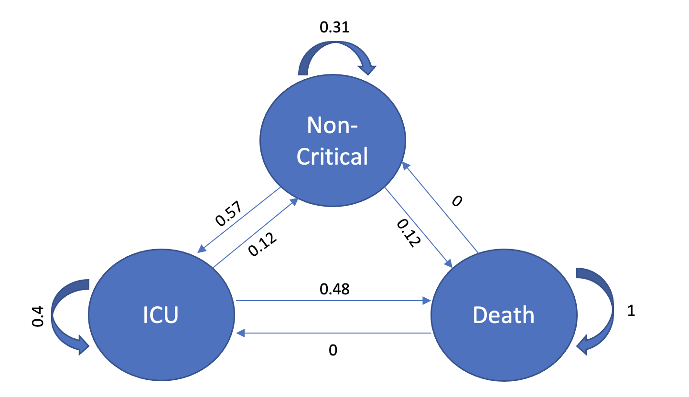
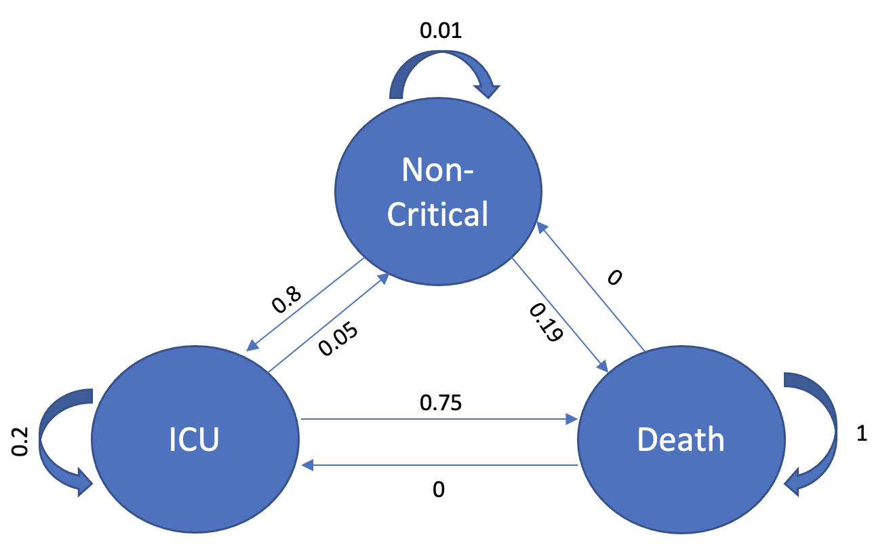

# Project 2

## Requirements
To install the requirements please run:
```bash
$ pip install -r requirements.txt
```

## Running the tests
The tests are written in pytest format such that each crucial Python file with a name `x.py` has an accompanying test file `test_x.py`.  Hence, to run all the tests, simply run:
```bash
$ pytest
```

## Introduction
This project predicts and compares the possibility of deaths, and critical states of covid-positive patients in Singapore for the upcoming day based on vaccination status using Markov Chain.
The model is used to answer questions such as: 
- In the next couple of days, what is the expected number of deaths and critical state patients among the fully vaccinated?
- In the next couple of days, what is the expected number of deaths and critical state patients among the non-vaccinated?

## Obtaining Data
The dataset has been obtained via the [Ministry of Health website](https://data.gov.sg/dataset/covid-19-case-numbers?resource_id=783f0c4c-caf7-4818-8683-760f3d7f0757). The dataset is called "7-Day moving average of deaths & active cases in ICU, per 100k population, by vax status." 

## Method
The details of each function are documented via comments in [main.py](main.py). 
Here is a brief overview of the implementation.
Taking the average of the 7-day data points given, I construct a full transition matrix consisting of the following states: Non-critical, Critical, and Death.

Transition Matrix | Non-critical | Critical (ICU) | Death
-- | -- | -- | --
Non-critical | x11 | x12 | x13
Critical (ICU) | x21 | x22 | x23
Death | x31 | x32 | x33

The transition states for vaccinated people are shown here:



And the non-vaccinated people:



Using the transition matrix, I use the Markov Chain to predict for the user-designated range (in days).

## Outcome and Limitations
After 6 days, the markov chain predicted the following for vaxed:

Transition Matrix | Non-critical | Critical (ICU) | Death
-- | -- | -- | --
Non-critical | 0.02 | 0.06 | 0.89
Critical (ICU) | 0.01 | 0.03 | 0.92
Death | 0 | 0 | 1

And the following for unvaxed:

Transition Matrix | Non-critical | Critical (ICU) | Death
-- | -- | -- | --
Non-critical | 0 | 0 | 1
Critical (ICU) | 0 | 0 | 1
Death | 0 | 0 | 1

We can already see the numbers converging to death regardless of the starting state. 
Based on this, everyone who tests positive could die in a matter of weeks. 
This is an extremely pessimistic view of how Covid could play out.
This may be because the state of testing negative has not been included in the transition matrix. 
This makes the stochastic process an inaccurate representation of the reality, as people do test negative as an alternative to staying ill or dying. 
This may have been the reason for such a pessimistic convergence of the model.

Along the way, I realized that there is no data to represent the state change from critical to death. I tried to obtain the data by comparing the number of covid patients utilizing the ICU bed versus the number of people died that day, but because the data for daily death toll does not separate patients from ICU versus patients from non-critical (non-ICU) beds, this approach was to no avail. In the end, I took the average ICU mortality rate from the [Singapore Medical Journal](http://www.smj.org.sg/article/factors-associated-mortality-among-patients-active-pulmonary-tuberculosis-requiring). 
